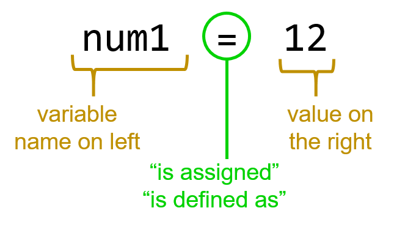

# M2: Core 4: Variables
[23 SEP 2019]

## What is a variable?
**The computer can store information for you**
A variable is a location where a computer can store information. Variables have two parts: the identifier, which is the name used to identify the variable, and the value, which is the information it stores.

<p align="center">
     
</p>


## Try out some basic variables in Python
1. Left-click the Windows button (bottom left of the screen; has Windows icon); a menu of options will appear but don't click anything.
1. Using the keyboard, type `idle`.
1. You should see an 'IDLE (Python 3...)' App option; left-click the line numbered code icon.
1. Inside your Python 3.\* shell, type the following two lines, hitting the enter key after each command:
    ````
    name1="Grace Hopper"
    print(name1)
    ````
    You should see the words `Grace Hopper` repeated after your print command. This means you stored the value `Grace Hopper` into the variable named `name1` and, when ordered to do so, the computer printed the value stored in that variable back to you.
1. Try to assign different values and variables:
    ```
    name1="Shuri"
    print(name1)
    name2=name1
    print(name2)
    ```
    Can you think through the variable assignment and answer why `name2` got the value `Shuri` and not `Grace Hopper`?
1. Try a value swap failure example:
    ```
    num1 = 3
    num2 = 12
    num1 = num2
    num2 = num1
    print(num1)
    print(num2)
    ```
    Why did `num2` not get the number 3?
    
    *Note:* Python doesn't care if you have spaces or no spaces between the variable names, assignment operator `=`, and the values.
1. Now swap variable values successfully:
    ```
    color1 = "teal"
    color2 = "awesome"
    tempcolor = color1
    color1 = color2
    color2 = tempcolor
    print(color1)
    print(color2)
    ```
    Why did this variable value swap work but didn't in the previous example?
    
    *Note:* Yes, awesome is a color! https://encycolorpedia.com/ff2052 #ff2052 or RGB(255,32,82).

## Identify and change variables in the game
1. With the Python 3 Shell screen selected, left-click on 'File' and then 'Open' (note, you can also press CTRL+O to do the same thing with hotkeys).
1. If this computer was used last meeting, you should be able to left-click on 'Desktop' from the left-side of the Open window then double-left-click into the 'GWC' folder and then into the 'GWC2019game' folder. Left-click on the 'basicGame2019.py' file and then click the 'Open' button.
    *Note:* If the GWC and game folder don't exist on this computer or you don't know where to find them, go back to the Meeting 1 instructions for making a local copy of the game.
1. In the Python file view window, locate the following code (lines 8-13) and then think through these questions:
    ```
    # 2 - Set game global variables
    boardsize = (512, 512)
    screen = pygame.display.set_mode(boardsize)
    width, height, margin = 100, 100, 2
    BLACK = (0, 0, 0)
    WHITE = (255,255,255)
    ```
    1. Except for the leading comment line (starting with the `#` sign), do all of these lines use the variable assignment operator `=`?
    1. What are the names of the variables? Do you see the line where three separate names get assigned three separate values?
1. The name of variables only matters to your code readability and not to the values that make your program work. Before we change anything, run the game as-is to remind yourself how it looks:
    1. Hit the F5 button on your keyboard to load the code into a shell.
    1. Move the game window and the Python shell window around on your screen so you can see both of them at the same time.
    1. Use the arrow keys on the keyboard or the 'a','s','d', and 'w' keys to move the player on the board and collect the Core 4 -- look specifically for where the color black appears as you play the game.
1. Now let's make some changes to the Python file -- change the value assigned to the variable `WHITE` to the following:
    ```
    WHITE = (127,127,127)
    ```
    Save the game (CTRL+S) and run the game (F5) to look for what changed. 
1. Explore the difference: go to https://www.colorspire.com/rgb-color-wheel/ and enter RGB values (0,0,0) into the appropriate fields and hit enter -- what color do you see? Do the same for RGB values (127,127,127) and be sure to hit enter -- what color do you see now?

    *Note:* Color encoding can be done many ways; two popular ways are with red,blue,green values (e.g. (127,127,127)) or a 6-digit hexadecimal code (e.g. #7F7F7F).
1. Look for where the variable `WHITE` is used in the game code.
    1. With the Python file window selected, type CTRL+F
    1. In the 'Find:' box, type `WHITE` and left-click 'Find Next'
    1. Note that first the variable is set and then it is used as a value to assign to a different variable. What is the name of that different variable?
1. Change another variable -- this time, find the 'playerCoord' variable and change it and the grid variable below it to the following:
    ```
    playerCoord = [3,2]
    grid[3][2] = 1
    ```
    Note here that we changed the array coordinates for the grid variable, not the value assigned to them. Save (CTRL+S) and run (F5) the game to see what changed and then check out where the playerCoord variable value is used in the code.