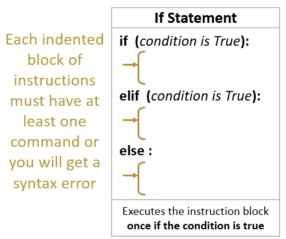

# M3: Core 4: Conditionals
[21 OCT 2019]

## What is a conditional?
**The computer can make decisions for you**
Conditionals use data and true/false commands to make decisions for you. They are most often structured as if statements or if/else statements.

<p align="center">
     
</p>


## Try out some basic conditional statements in Python
1. Left-click the Windows button at the bottom left of the screen.
1. Using the keyboard, type `idle` and then left-click the icon.
1.  Inside your Python 3.\* shell, left-click the 'File' menu option and select 'New File' (note you can also do this with CTRL+N).
1. Inside the IDLE file window (it doesn't have the `>>>` prompt, so you know it's not a shell), type the following including the indentations:
    ```
    num1 = 5
    num2 = 6
    if (num1 > num2):
      print(str(num1)+" is greater than "+str(num2))
    else:
      print(str(num2)+" is less than "+str(num1))
    ```
1. Press CTRL+S from your keyboard to save the file; a Windows file explorer window will appear. Click the Desktop option on the left side of the window -- if the GWC folder is there, left-click twice into the GWC folder. If it is not there, left-click 'New folder' and create a folder on the desktop named 'GWC'. Enter 'conditionals.py' into the File name box and then left-click 'Save'.
1. To run the code from your Python file from IDLE, press the F5 button on your keyboard. In the Python 3 IDLE shell, you should see a `RESTART: ` line followed by the file path to the file you just loaded and ran. Your file's output is listed below this line. Is it what you expected?
    *Reflect:* What does the `>` operator do? Why don't you need to put a condition on the else statement?
1. Python has built-in functions to check the length of a word (string of characters). We'll next use this to print out a statement based on setting a variable for a name. Click back into the file window (which now says 'conditionals.py' and gives the filepath at the top) and add the following set of Python commands:
    ```
    
    name = "YourFirstName"
    if len(name) > 5:
      print("Your name is greater than 5 characters long")
    elif len(name) == 5:
      print("Your name is equal to 5 characters long")
    else:
      print("Your name is less than 5 characters long")
    ```
    *Note:* Type your own name inbetween the quotation marks!
1. Select the previous six lines you typed, left-click the Format menu option, and select the Comment Out Region option. Verify that the previous code now appears in a different color with `#` signs at the beginning of the line.
1. Press CTRL+S (you won't have to choose a file name and location because you are updating the same file you already created) followed by F5 to run your updated code. Did you get what you expected to get? Try running the code again with  different values for the name variable that will get you each of the possible results.

## Identify and change conditionals in the game
1. With the Python 3 Shell screen selected, left-click on 'File' and then 'Open' (note, you can also press CTRL+O to do the same thing with hotkeys).
1. If this computer was used last meeting, you should be able to left-click on 'Desktop' from the left-side of the Open window then double-left-click into the 'GWC' folder and then into the 'GWC2019game' folder. Left-click on the 'basicGame2019.py' file and then click the 'Open' button.
    *Note:* If the GWC and game folder don't exist on this computer or you don't know where to find them, go back to the Meeting 1 instructions for making a local copy of the game.
1. In the Python file view window, locate the following code (lines 113-115, at the bottom of the file):
    ```
    if score == 4: # Check for exit condition congratulatory message
      print("Congratulations on learning all of the Core 4!")
      print("Now practice practice practice and create cool code!")
    ```
1. Change the condition to the following:
    ```
    if score == 2: # Check for exit condition congratulatory message
    ```
1. Run the game to see what changed:
    1. Hit the F5 button on your keyboard to load the code into a shell.
    1. Move the game window and the Python shell window around on your screen so you can see both of them at the same time.
    1. Use the arrow keys on the keyboard or the 'a','s','d', and 'w' keys to move the player on the board and collect the Core 4 -- look specifically for when the game ends.
    1. Because you just created an infinite loop, select the shell window and **hit CTRL+C to stop the madness!**