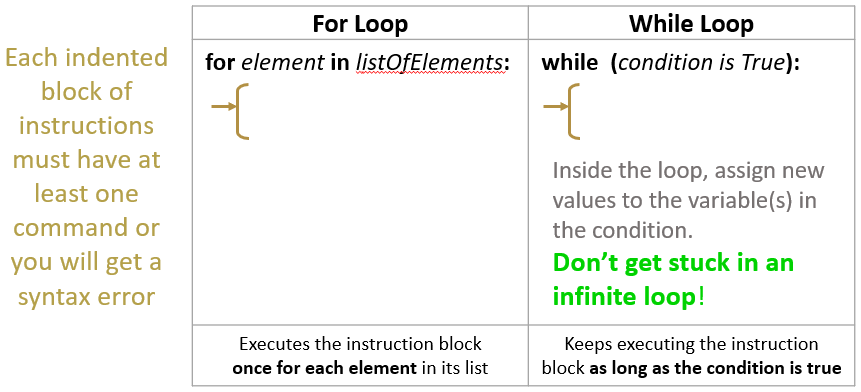

# M4: Core 4: Loops
[21 OCT 2019]

## What is a loop?
**The computer can do repeated work for you**
A loop is a set of instructions that will be repeated more than once. Loops can happen indefinitely, or a set number of times.

<p align="center">
     
</p>


## Try out some basic loops in Python
1. Left-click the Windows button at the bottom left of the screen.
1. Using the keyboard, type `idle` and then left-click the icon.
1. Inside your Python 3.\* shell, left-click the 'File' menu option and select 'New File' (note you can also do this with CTRL+N).
1. Inside the IDLE file window, type the following:
    ```
    for i in [1,2,3]:
      print(2*i)
    ```
    *Note:* 'i' is an iterator that takes each value of the for loop's list in sequence. How many print statements do you think will print when you run this code? What about if the list has 10 items or 1 item?
1. Press CTRL+S from your keyboard to save the file; a Windows file explorer window will appear. Click Desktop -- if the GWC folder is there, left-click twice into the GWC folder. If it is not there, left-click 'New folder' and create a folder on the desktop named 'GWC'. Enter 'loops.py' into the File name box and then left-click 'Save'.
1. To run the code from your Python file from IDLE, press the F5 button on your keyboard. In the Python 3 IDLE shell, you should see a `RESTART: ` line followed by the file path to the file you just loaded and ran. Your file's output is listed below this line. Is it what you expected?
1. To try another example, click back into the file window and add the following set of Python commands:
    ```
    
    for x in range(1,4):
      print(2*x)
    ```
    *Note:* Here we use 'x' instead of 'i' as the name of our iterator; we could name it anything that doesn't already have a name. We also use a range function -- for details on this, see the Python documentation with examples at:  https://docs.python.org/3/library/stdtypes.html#typesseq-range
1. Select the previous two lines you typed, left-click the Format menu option, and select the Comment Out Region option. Verify that the previous code now appears in a different color with `#` signs at the beginning of the line.
1. Press CTRL+S followed by F5 to run your updated code. Did you get what you expected to get?
1. To try a while loop, go back to your Python file and highlight and comment out the previous code. Type the following into the file:
    ```
    
    n = 1
    while (n < 4):
      print(2*n)
      n = n + 1
    ```
1. Press CTRL+S followed by F5 to run your updated code.
    *Reflect:* If you didn't increment the value of n inside of the loop, would you ever exit the loop?

## Identify and change loops in the game
1. 