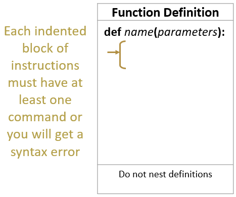

# M6: Core 4: Functions
[18 NOV 2019]

## What is a function?
**The computer can bundle commands and refer back to these bundles when you need them**

A function is a set of commands that produces a specific action. Some languages have built-in functions, such as `print( )` in Python, and move in Scratch. Most languages will also let programmers write their own functions. Programmers use functions to create a process that can easily be used and reused in their code, rather than writing out the process every time.

     

## Recognize what functions and using functions look like in Python
1. Using Windows file explorer, find the folder with the Python games and right click and open both games in IDLE: basicGame2019.py and functionGame2019.py -- if you've changed the basicGame2019.py code, rename your changed code (as per Add Content #2 at https://github.com/jinnyyan/gwc19-game/blob/master/lessons/python/M5gitGood.md) and pull a fresh copy of the repository.
1. Set up your windows so you can see both at one time (with one IDLE window selected, you could press the Windows button and the left arrow at once -- WIN + left, and then the Windows button and the right arrow for the other window -- WIN + right).
1. Do these games play exactly the same? F5 both of the games to play through them to check.
1. How many lines start with `def` in the basic game? How many lines start with `def` in the function game?
1. 

## Identify and change functions in the game
1. 